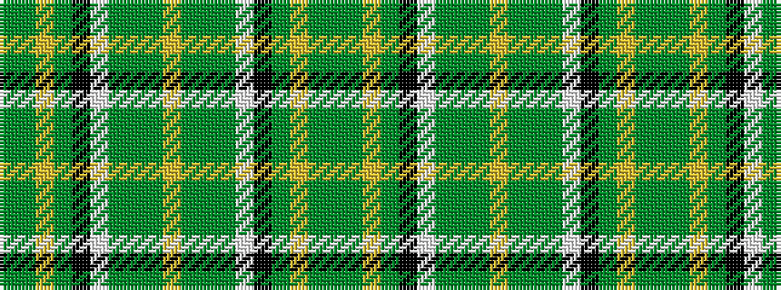

GGYGKWGGGYGGGWKGYGG

It is a 19 stripe tartan.

<figure class="pat-woven">

<figcaption>idealised sample</figcaption>
</figure>

## Colour Sequence



## Tartans with this colour sequence

| Tartans |
|---------------|
| [Irish National District Tartan](/variants/s19/g36dg5ly5dg9k5w5dg2g7dg1ly2dg1g7dg2w5k5dg9ly5dg5g17~x2/)|
||
