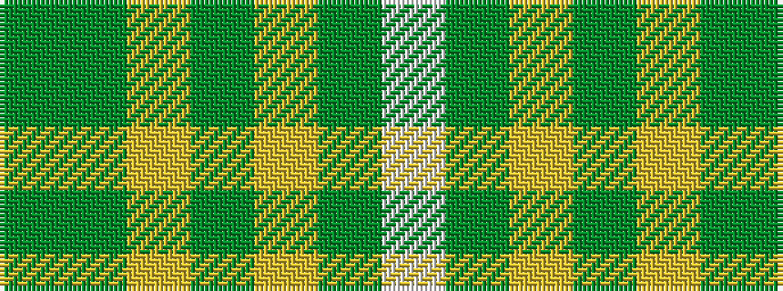

GGYGYGW

It is a 7 stripe tartan.

<figure class="pat-woven">

<figcaption>idealised sample</figcaption>
</figure>

## Colour Sequence



## Tartans with this colour sequence

| Tartans |
|---------------|
| [European Union](/variants/s7/w6g64ly2g20ly38g20g1/)|
||
