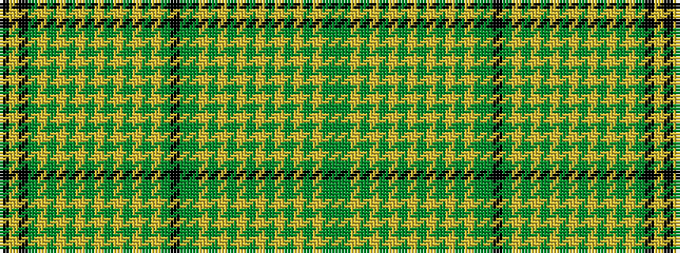

GGYGYGYGYGYGYGYGGKGYGYGYGYGYGYGYGKYK

It is a 36 stripe tartan.

<figure class="pat-woven">

<figcaption>idealised sample</figcaption>
</figure>

## Colour Sequence



## Tartans with this colour sequence

| Tartans |
|---------------|
| [Alberta (Commemorative)](/setts/s36/k50lo16k8dy8lo1dy1lo1dy1lo1dy1lo1dy1lo1dy1lo1dy1lo20dy40k12dy24dg8lo1dg1lo1dg1lo1dg1lo1dg1lo1dg1lo1dg1lo28dg6dy4/)|
||
| [Nova Scotia (Commemorative)](/setts/s36/k50lo16k8dg8lo1dg1lo1dg1lo1dg1lo1dg1lo1dg1lo1dg1lo20dg40k12dg24g8lo1g1lo1g1lo1g1lo1g1lo1g1lo1g1lo28g6dg4/)|
||
