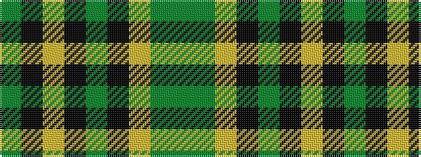

GGYKGKYKG

It is a 9 stripe tartan.

<figure class="pat-woven">

<figcaption>idealised sample</figcaption>
</figure>

## Colour Sequence



## Tartans with this colour sequence

| Tartans |
|---------------|
| [Maine Acadia](/variants/s9/g5k1lo2k1g19k15lo2y20g3~x2/)|
||
