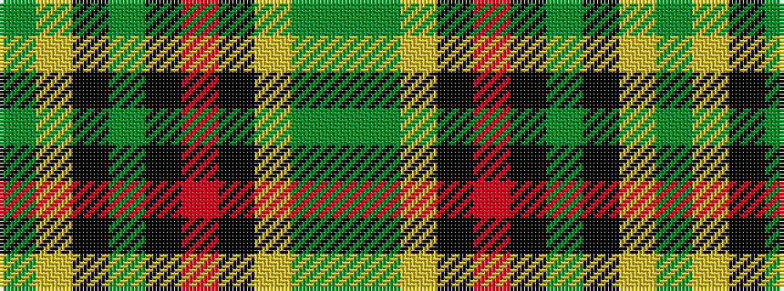

GGYKRKGKYG

It is a 10 stripe tartan.

<figure class="pat-woven">

<figcaption>idealised sample</figcaption>
</figure>

## Colour Sequence



## Tartans with this colour sequence

| Tartans |
|---------------|
| [Fitzsimmons Red (Name)](/setts/s10/dy3y2lo18k4r15k4dy6k4lo2y3~x2/)|
||
