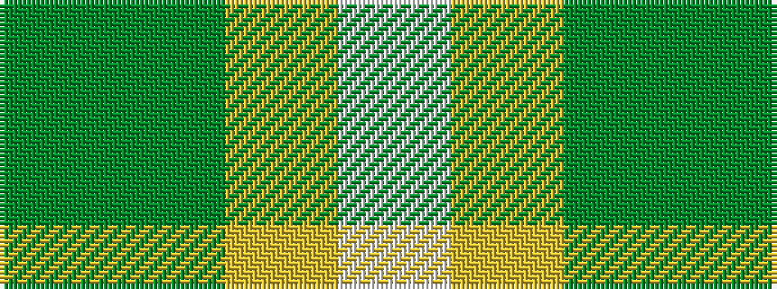

GGYW

It is a 4 stripe tartan.

<figure class="pat-woven">

<figcaption>idealised sample</figcaption>
</figure>

## Colour Sequence



## Tartans with this colour sequence

| Tartans |
|---------------|
| [Colonial Marine (Aliens Legacy)](/setts/s4/g56dy13ly13w5~x2/)|
||
