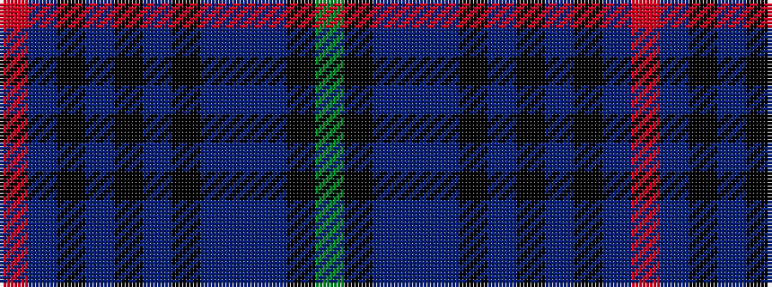

GKBBBKBKBKBR

It is a 12 stripe tartan.

<figure class="pat-woven">

<figcaption>idealised sample</figcaption>
</figure>

## Colour Sequence



## Tartans with this colour sequence

| Tartans |
|---------------|
| [Pride of Wales (Fashion)](/setts/s12/g12k40db4t4db4k28db7k8db7k8db10r4/)|
||
