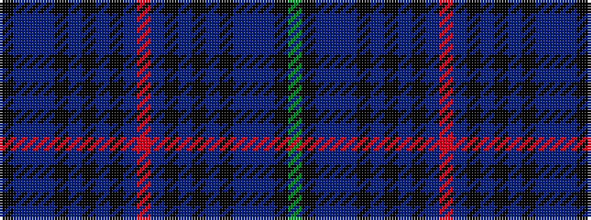

GKBBBKBKBKBRBKBKBKBBBK

It is a 22 stripe tartan.

<figure class="pat-woven">

<figcaption>idealised sample</figcaption>
</figure>

## Colour Sequence



## Tartans with this colour sequence

| Tartans |
|---------------|
| [Pride (Wales)](/variants/s22/k40db4t4db4k28db7k8db7k8db10r4db10k8db7k8db7k28db4t4db4k40g12/)|
||
