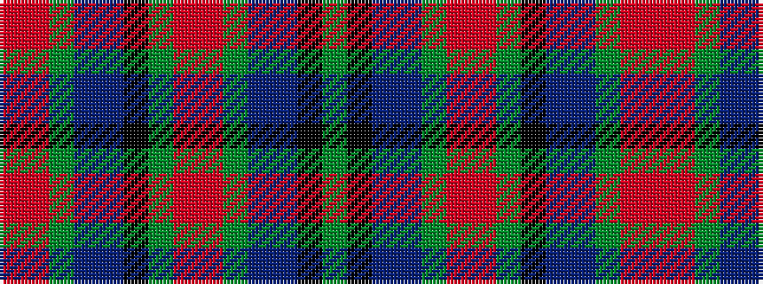

GKBBGRRGKBBGRR

It is a 14 stripe tartan.

<figure class="pat-woven">

<figcaption>idealised sample</figcaption>
</figure>

## Colour Sequence



## Tartans with this colour sequence

| Tartans |
|---------------|
| [Heart of Alba](/variants/s14/dg48k5db4t2dg1r2o4dg20k3db4t2dg1o4r2~x2/)|
||
