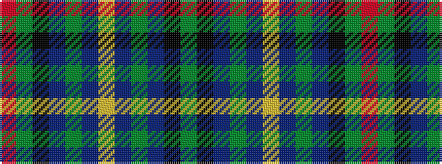

GKBGBYBGBKGR

It is a 12 stripe tartan.

<figure class="pat-woven">

<figcaption>idealised sample</figcaption>
</figure>

## Colour Sequence



## Tartans with this colour sequence

| Tartans |
|---------------|
| [Junior Chamber International](/setts/s12/dg16k16db4dg3db12lo2db12dg3db4k16dg16r4~x2/)|
||
