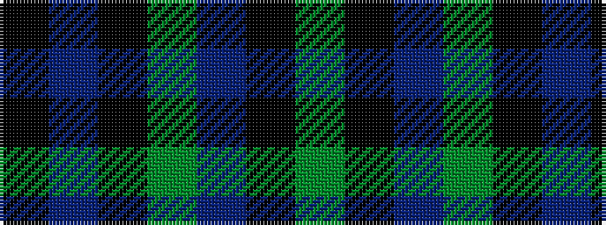

GKBGKBK

It is a 7 stripe tartan.

<figure class="pat-woven">

<figcaption>idealised sample</figcaption>
</figure>

## Colour Sequence



## Tartans with this colour sequence

| Tartans |
|---------------|
| [MacCallum](/setts/s7/g21k6t3g11k17db17k3~x2/)|
||
| [MacCallum](/setts/s7/g8k2t1g4k6db6k1~x2/)|
||
| [MacCallum](/setts/s7/dg8k2b1dg4k6db6k1~x2/)|
||
