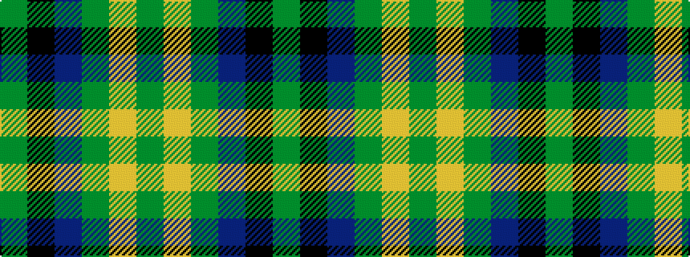

GKBGYG

It is a 6 stripe tartan.

<figure class="pat-woven">

<figcaption>idealised sample</figcaption>
</figure>

## Colour Sequence



## Tartans with this colour sequence

| Tartans |
|---------------|
| [Dobson (Palm Bay) (Personal)](/variants/s6/g15ly1dy2db5k4dg5~x6/)|
||
