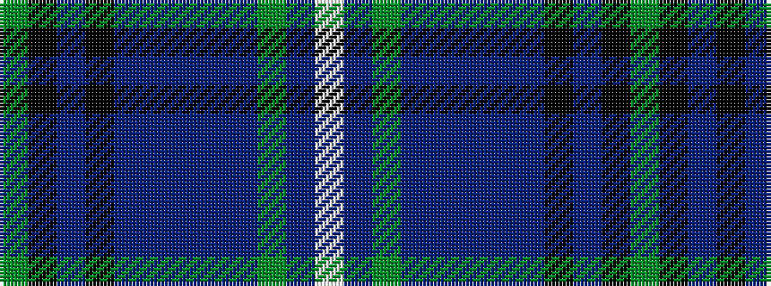

GKBKBBBBBGBW

It is a 12 stripe tartan.

<figure class="pat-woven">

<figcaption>idealised sample</figcaption>
</figure>

## Colour Sequence



## Tartans with this colour sequence

| Tartans |
|---------------|
| [Hand, Edinburgh](/setts/s12/dg1k8n5k23n5db3n5dp3n5dg5n3w1~x2/)|
||
