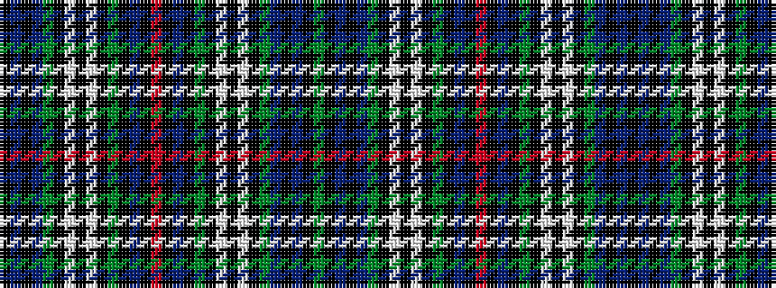

GKBKBGKWKWKGKBKRKBKGKWKWKGBKBK

It is a 30 stripe tartan.

<figure class="pat-woven">

<figcaption>idealised sample</figcaption>
</figure>

## Colour Sequence



## Tartans with this colour sequence

| Tartans |
|---------------|
| [Stephenson Hunting #2](/variants/s30/r2k1b9k9g9k1w1k2w1k1g9b9k9b9k1g2~x4/)|
||
