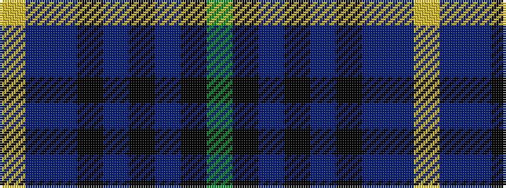

GKBKBKBBY

It is a 9 stripe tartan.

<figure class="pat-woven">

<figcaption>idealised sample</figcaption>
</figure>

## Colour Sequence



## Tartans with this colour sequence

| Tartans |
|---------------|
| [West of Wells (Personal)](/setts/s9/dg28k2dbi3k11dbi3k2dbi17db4lr2~x2/)|
||
