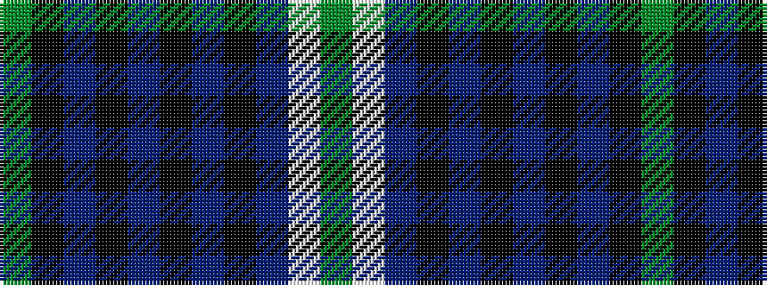

GKBKBKBKBWG

It is a 11 stripe tartan.

<figure class="pat-woven">

<figcaption>idealised sample</figcaption>
</figure>

## Colour Sequence



## Tartans with this colour sequence

| Tartans |
|---------------|
| [Bute Heather, Grey](/variants/s11/y6lb1n18k6n4k4n8k1n8k2y5~x2/)|
||
| [Bute Heather, Weathered](/variants/s11/dy6w1do18k6do4k4do8k1do8k2dy5~x2/)|
||
