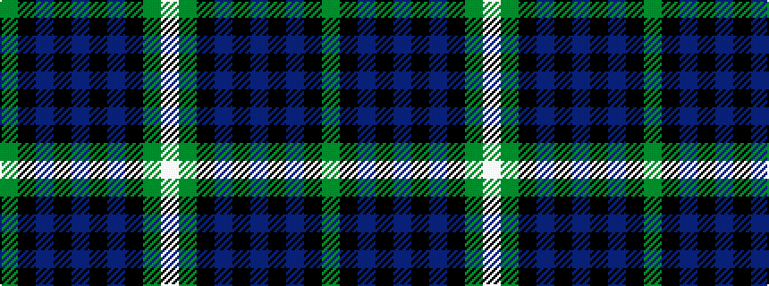

GKBKBKBKGW

It is a 10 stripe tartan.

<figure class="pat-woven">

<figcaption>idealised sample</figcaption>
</figure>

## Colour Sequence



## Tartans with this colour sequence

| Tartans |
|---------------|
| [Granger/Grainger (Personal)](/variants/s10/g27k21db12k4db40k4db12k21g27w4~x2/)|
||
