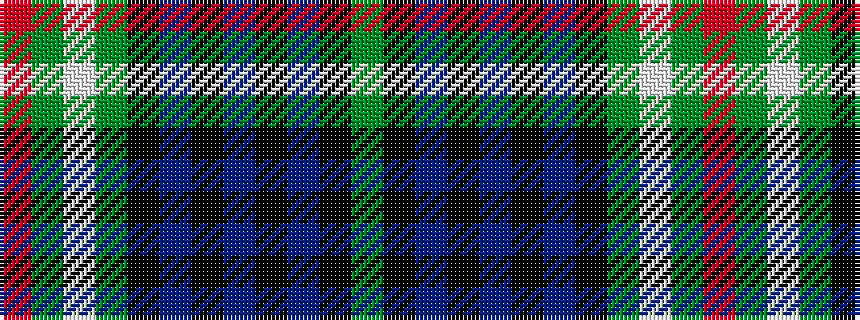

GKBKBKBKGWGR

It is a 12 stripe tartan.

<figure class="pat-woven">

<figcaption>idealised sample</figcaption>
</figure>

## Colour Sequence



## Tartans with this colour sequence

| Tartans |
|---------------|
| [Spar (UK) Ltd](/variants/s12/g9k9b10k1b2k2b10k9g9w1g2r1~x4/)|
||
