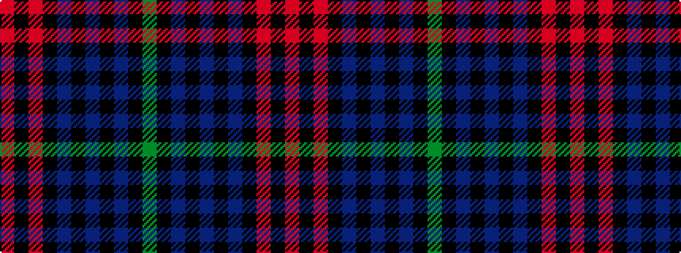

GKBKBKBKRKR

It is a 11 stripe tartan.

<figure class="pat-woven">

<figcaption>idealised sample</figcaption>
</figure>

## Colour Sequence



## Tartans with this colour sequence

| Tartans |
|---------------|
| [Brotherhood of Dirk (Corporate)](/variants/s11/r9k3r9k2b4k4dp4k3dp2k32y6~x2/)|
||
