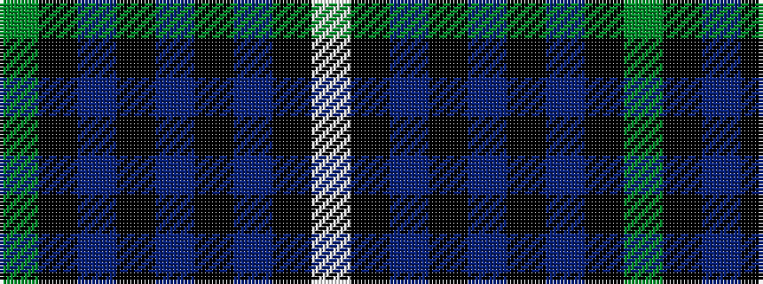

GKBKBKBKW

It is a 9 stripe tartan.

<figure class="pat-woven">

<figcaption>idealised sample</figcaption>
</figure>

## Colour Sequence



## Tartans with this colour sequence

| Tartans |
|---------------|
| [Unidentified (School)](/setts/s9/y35k3db2k5db3k1db20k3w3~x2/)|
||
