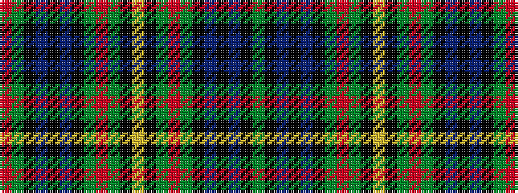

GKBKBKGRGKYKGRGKBKBKGR

It is a 22 stripe tartan.

<figure class="pat-woven">

<figcaption>idealised sample</figcaption>
</figure>

## Colour Sequence



## Tartans with this colour sequence

| Tartans |
|---------------|
| [Paterson Clan/Family Weavers Tartan Tartan Number: 3886. Earliest known date: pre 2002 Dalgliesh variation. See products available Copyright © Blair Urquhart, Comrie, 2015](/setts/s22/g12k12db15k2db15k12g5r2g5k1ly3k1g5r2g5k12db15k2db15k12g12r2~x2/)|
||
