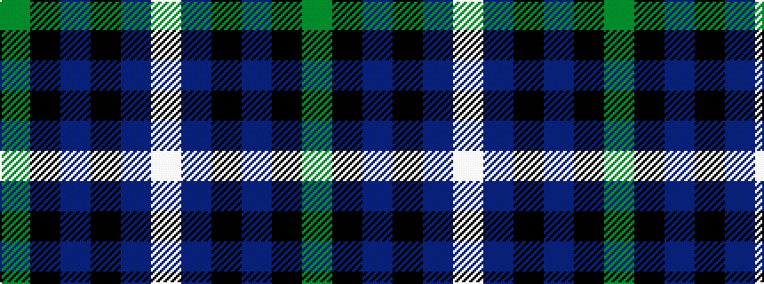

GKBKBW

It is a 6 stripe tartan.

<figure class="pat-woven">

<figcaption>idealised sample</figcaption>
</figure>

## Colour Sequence



## Tartans with this colour sequence

| Tartans |
|---------------|
| [Pride of Yorkland (Fashion)](/setts/s6/g35k3dbi26k4db4w3~x2/)|
||
