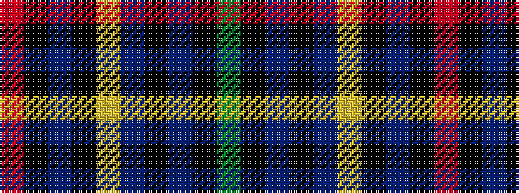

GKBKBYKBKR

It is a 10 stripe tartan.

<figure class="pat-woven">

<figcaption>idealised sample</figcaption>
</figure>

## Colour Sequence



## Tartans with this colour sequence

| Tartans |
|---------------|
| [Timmins (2013)](/setts/s10/r4k2dp14k12lo1t32k12t14k2g4~x2/)|
||
