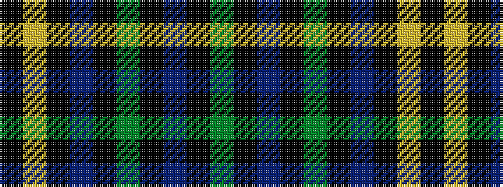

GKBKGKBKYK

It is a 10 stripe tartan.

<figure class="pat-woven">

<figcaption>idealised sample</figcaption>
</figure>

## Colour Sequence



## Tartans with this colour sequence

| Tartans |
|---------------|
| [Hope-Vere (Lochcarron)](/setts/s10/g16k1t2k1g3k5n12k1ly1k3~x4/)|
||
