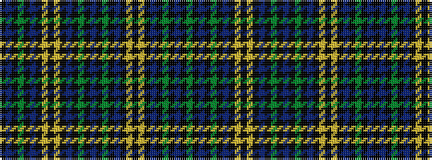

GKBKGKBKYKYKBKGKBKGKBKYKYKBKGKBK

It is a 32 stripe tartan.

<figure class="pat-woven">

<figcaption>idealised sample</figcaption>
</figure>

## Colour Sequence



## Tartans with this colour sequence

| Tartans |
|---------------|
| [Weir](/setts/s32/dg18k1b3k1dg3k8db18k1ly1k5ly1k1db18k8dg2k1b2~x2/)|
||
