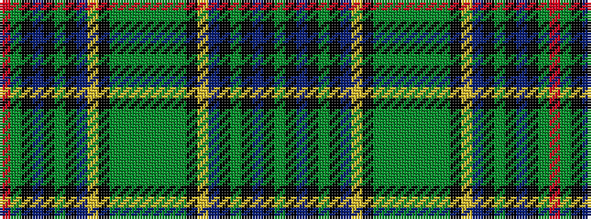

GKBKGKBYKGGGGGGGKYBKGKBKGR

It is a 26 stripe tartan.

<figure class="pat-woven">

<figcaption>idealised sample</figcaption>
</figure>

## Colour Sequence



## Tartans with this colour sequence

| Tartans |
|---------------|
| [Leinster Irish District Tartan Tartan Number: 4062. Earliest known date: 1997 One of the collection of Irish tartans to acknowledge the early historical and cultural links between the Scots and the Irish. Dublin is the principal city of Leinster. Woven swatch. See products available Copyright © Blair Urquhart, Comrie, 2015](/setts/s26/g18k10db12k1g2k1db12ly2k10g2g2g15g3g15g2g2k10ly2db12k1g2k1db12k10g18r3~x2/)|
||
