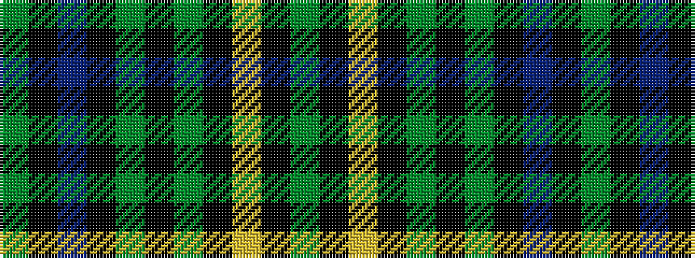

GKBKGKGKYKG

It is a 11 stripe tartan.

<figure class="pat-woven">

<figcaption>idealised sample</figcaption>
</figure>

## Colour Sequence



## Tartans with this colour sequence

| Tartans |
|---------------|
| [Choinka Family (Personal)](/setts/s11/dy4k2lo3k2dy7k9g20k2t3k2g4~x2/)|
||
