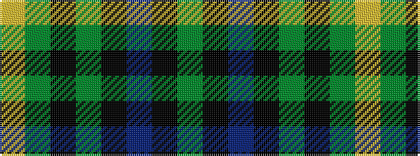

GKBKGKGY

It is a 8 stripe tartan.

<figure class="pat-woven">

<figcaption>idealised sample</figcaption>
</figure>

## Colour Sequence



## Tartans with this colour sequence

| Tartans |
|---------------|
| [Mackie (2016)](/variants/s8/g2k1db6k11g26k1g1lo2~x2/)|
||
