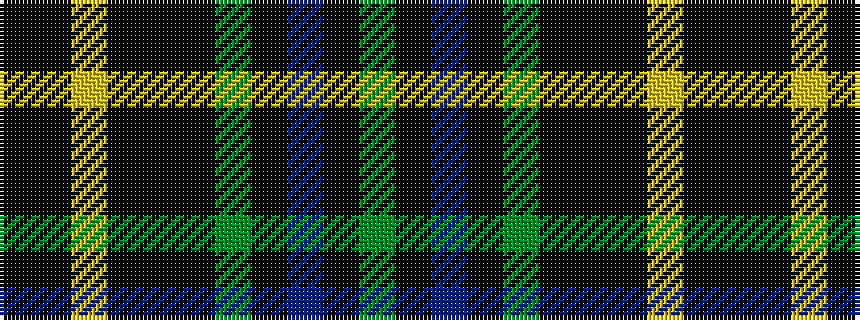

GKBKGKKKYKK

It is a 11 stripe tartan.

<figure class="pat-woven">

<figcaption>idealised sample</figcaption>
</figure>

## Colour Sequence



## Tartans with this colour sequence

| Tartans |
|---------------|
| [Choinka Family (Inverness)](/setts/s11/k4k2ly3k2k7k9dg20k2n3k2dg4~x2/)|
||
