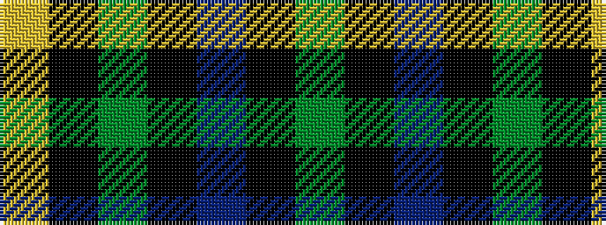

GKBKGKY

It is a 7 stripe tartan.

<figure class="pat-woven">

<figcaption>idealised sample</figcaption>
</figure>

## Colour Sequence



## Tartans with this colour sequence

| Tartans |
|---------------|
| [Caledonian Canals (Corporate)](/setts/s7/dg2k1db29k2dg9k27lo2~x2/)|
||
