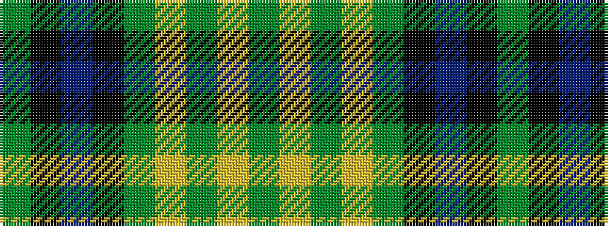

GKBKGYGYG

It is a 9 stripe tartan.

<figure class="pat-woven">

<figcaption>idealised sample</figcaption>
</figure>

## Colour Sequence



## Tartans with this colour sequence

| Tartans |
|---------------|
| [Fitzpatrick Hunting](/setts/s9/g5ly1g3ly2g8k8db1k8g1~x4/)|
||
