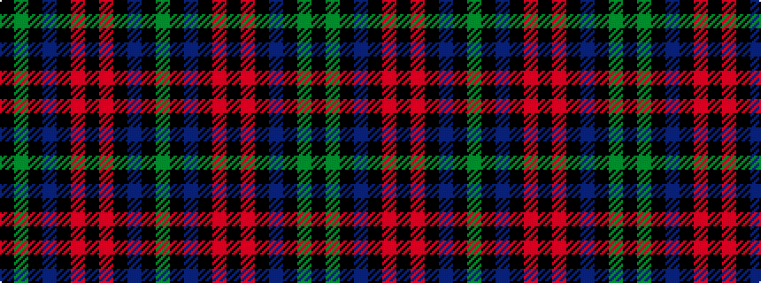

GKBKRKRKBKGK

It is a 12 stripe tartan.

<figure class="pat-woven">

<figcaption>idealised sample</figcaption>
</figure>

## Colour Sequence



## Tartans with this colour sequence

| Tartans |
|---------------|
| [Wilson's No.007 Or Eglinton](/variants/s12/g5k4dp28k4r5k4r5k4dp28k4g5k4~x2/)|
||
