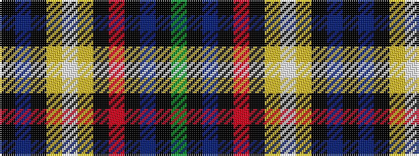

GKBKRKYWYKBK

It is a 12 stripe tartan.

<figure class="pat-woven">

<figcaption>idealised sample</figcaption>
</figure>

## Colour Sequence



## Tartans with this colour sequence

| Tartans |
|---------------|
| [Auchinachie](/variants/s12/k2db12k8lg10w1lg10k4r1k4db12k2g2~x2/)|
||
