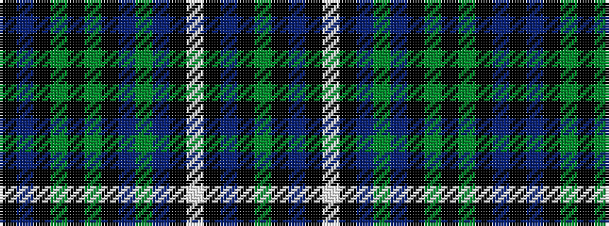

GKBKWKBGBKGKGKBK

It is a 16 stripe tartan.

<figure class="pat-woven">

<figcaption>idealised sample</figcaption>
</figure>

## Colour Sequence



## Tartans with this colour sequence

| Tartans |
|---------------|
| [Maxem Eyewear](/setts/s16/k8do78k8y8k4y4k4do13y1do4k4w4k4do52k4y1~x4/)|
||
