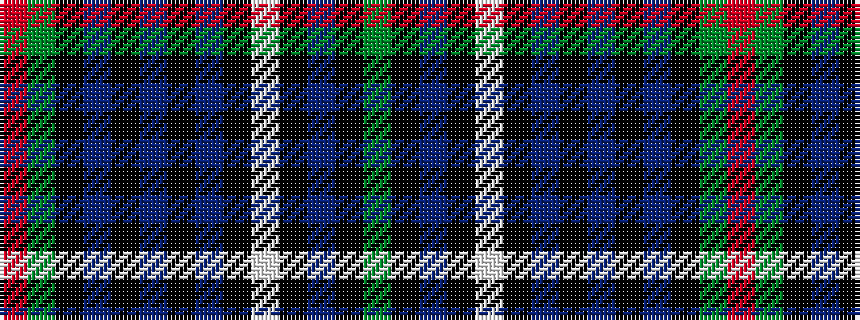

GKBKWKBKBKBKGR

It is a 14 stripe tartan.

<figure class="pat-woven">

<figcaption>idealised sample</figcaption>
</figure>

## Colour Sequence



## Tartans with this colour sequence

| Tartans |
|---------------|
| [Encyclopaedia Britannica (Corporate)](/setts/s14/g12k5db18k5w5k5db18k3db6k3db6k5g12r5~x2/)|
||
