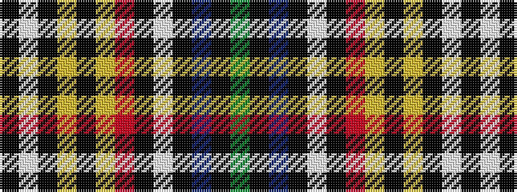

GKBKWKRYKYKWK

It is a 13 stripe tartan.

<figure class="pat-woven">

<figcaption>idealised sample</figcaption>
</figure>

## Colour Sequence



## Tartans with this colour sequence

| Tartans |
|---------------|
| [Ville de Beauport](/variants/s13/g16k1db12k1lb12k1r10ly7k1ly7k2lb1k4~x2/)|
||
