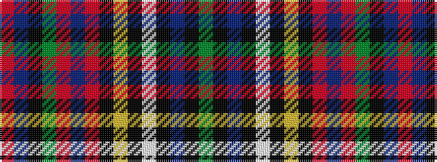

GKBKWKYKRBRGKBR

It is a 15 stripe tartan.

<figure class="pat-woven">

<figcaption>idealised sample</figcaption>
</figure>

## Colour Sequence



## Tartans with this colour sequence

| Tartans |
|---------------|
| [Australian Defence Force Academy (Co](/setts/s15/g3k1t34k2w2k2ly2k2r2db8r2g2k1t2r2~x2/)|
||
