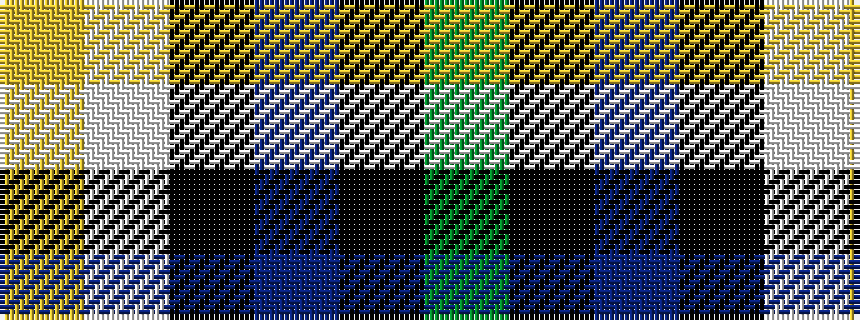

GKBKWY

It is a 6 stripe tartan.

<figure class="pat-woven">

<figcaption>idealised sample</figcaption>
</figure>

## Colour Sequence



## Tartans with this colour sequence

| Tartans |
|---------------|
| [Inverary](/setts/s6/y10k1db13k3lb9lo3~x2/)|
||
| [Inverary](/setts/s6/dg10k1db13k3w9ly3~x2/)|
||
| [Inverary Clan Tartan Tartan Number: 772. Earliest known date: pre 2003 From a miniature of Elizabeth Innes at (sic) Edingight from Adam See products available Copyright © Blair Urquhart, Comrie, 2015](/setts/s6/g10k1db13k3w9ly3~x2/)|
||
