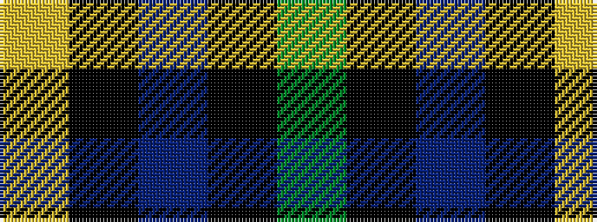

GKBKY

It is a 5 stripe tartan.

<figure class="pat-woven">

<figcaption>idealised sample</figcaption>
</figure>

## Colour Sequence



## Tartans with this colour sequence

| Tartans |
|---------------|
| [Carolina University, Western](/setts/s5/dg1k2dp27k2ly1~x2/)|
||
| [U.S. Border Patrol (Corporate)](/setts/s5/g40k15b10k10ly3~x2/)|
||
