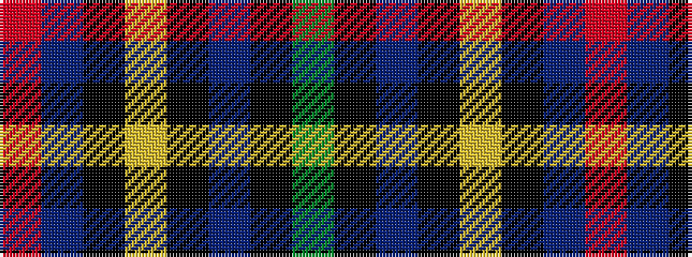

GKBKYKBR

It is a 8 stripe tartan.

<figure class="pat-woven">

<figcaption>idealised sample</figcaption>
</figure>

## Colour Sequence



## Tartans with this colour sequence

| Tartans |
|---------------|
| [Arundel County (Dalgleish)](/setts/s8/r2t5k4lo1k4db16k3g2~x4/)|
||
