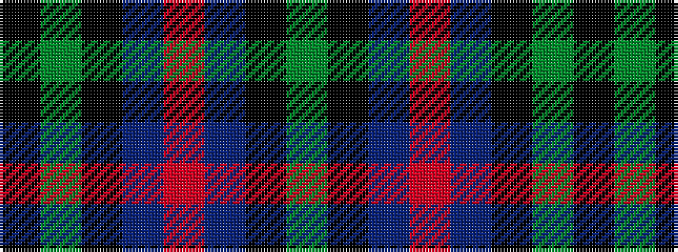

GKBRBKGK

It is a 8 stripe tartan.

<figure class="pat-woven">

<figcaption>idealised sample</figcaption>
</figure>

## Colour Sequence



## Tartans with this colour sequence

| Tartans |
|---------------|
| [Denholm](/setts/s8/g8k7db8r2db8k7g8k2~x2/)|
||
