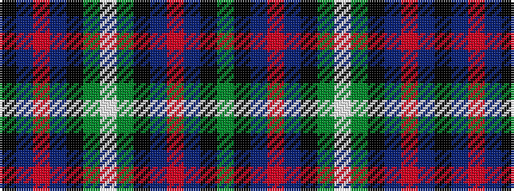

GKBRBKGWGKBRBK

It is a 14 stripe tartan.

<figure class="pat-woven">

<figcaption>idealised sample</figcaption>
</figure>

## Colour Sequence



## Tartans with this colour sequence

| Tartans |
|---------------|
| [Asher Personal Tartan Tartan Number: 3840. Earliest known date: 2002 Designed by Robert Asher of London to recognise his family's Scottish heritage. See products available Copyright © Blair Urquhart, Comrie, 2015](/setts/s14/dg40k2db3r4db3k2dg40w3~x2/)|
||
