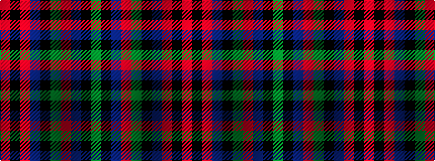

GKBRGKBRKR

It is a 10 stripe tartan.

<figure class="pat-woven">

<figcaption>idealised sample</figcaption>
</figure>

## Colour Sequence



## Tartans with this colour sequence

| Tartans |
|---------------|
| [Delanghe, Ruben (Personal)](/variants/s10/g14k5db2r21g18k4db18r9k2r12/)|
||
| [Ruben Delanghe (Personal)](/variants/s10/dg14k5db2r21dg18k4db18r9k2r12/)|
||
