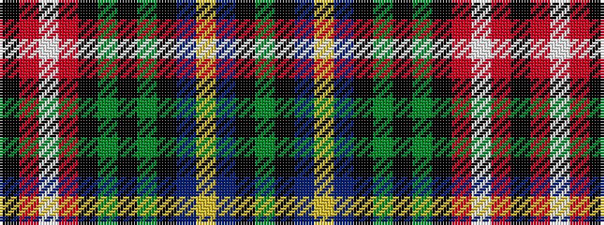

GKBYBKGKGKRWRK

It is a 14 stripe tartan.

<figure class="pat-woven">

<figcaption>idealised sample</figcaption>
</figure>

## Colour Sequence



## Tartans with this colour sequence

| Tartans |
|---------------|
| [Scandinavian](/setts/s14/g10k6t10ly4t10k3g10k3g10k3r10w4r10k6~x2/)|
||
