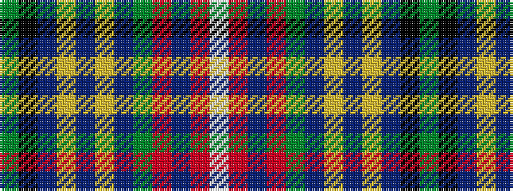

GKBYBYBGRBRW

It is a 12 stripe tartan.

<figure class="pat-woven">

<figcaption>idealised sample</figcaption>
</figure>

## Colour Sequence



## Tartans with this colour sequence

| Tartans |
|---------------|
| [Seller Clan (Personal)](/variants/s12/g46k3db6ly2db3ly2db3g7r6db2r3w4~x2/)|
||
| [Seller Sillar Family Tartan](/variants/s12/dy63k4t9ly2db4ly2db4dy11r8t2r4w5~x2/)|
||
| [Sillars (Name)](/variants/s12/g64k4db9ly2db4ly2db4g11r8db2r4w3~x2/)|
||
