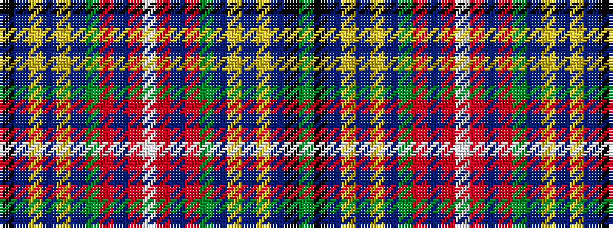

GKBYBYBGRBRWRBRGBYBYBK

It is a 22 stripe tartan.

<figure class="pat-woven">

<figcaption>idealised sample</figcaption>
</figure>

## Colour Sequence



## Tartans with this colour sequence

| Tartans |
|---------------|
| [Seller (Personal)](/setts/s22/g46k3db6ly2db3ly2db3g7r6db2r3w4~x2/)|
||
| [Sillars](/setts/s22/g64k4db9ly2db4ly2db4g11r8db2r4w3~x2/)|
||
