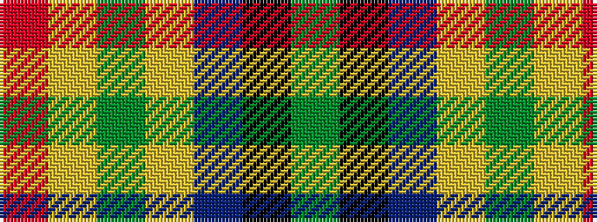

GKBYGYR

It is a 7 stripe tartan.

<figure class="pat-woven">

<figcaption>idealised sample</figcaption>
</figure>

## Colour Sequence



## Tartans with this colour sequence

| Tartans |
|---------------|
| [Traill (Personal)](/variants/s7/r16ly2dy7ly2t24k2g2~x2/)|
||
| [Traill Clan/Family Weavers Tartan](/variants/s7/r16ly2dy7ly2b24k2g2~x2/)|
||
