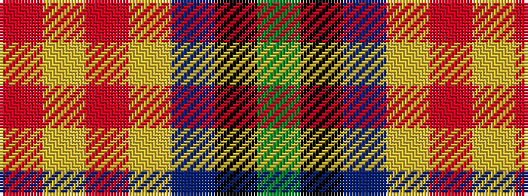

GKBYRYR

It is a 7 stripe tartan.

<figure class="pat-woven">

<figcaption>idealised sample</figcaption>
</figure>

## Colour Sequence



## Tartans with this colour sequence

| Tartans |
|---------------|
| [(4) Traill](/setts/s7/r8ly2o7ly2n24k2g1~x2/)|
||
