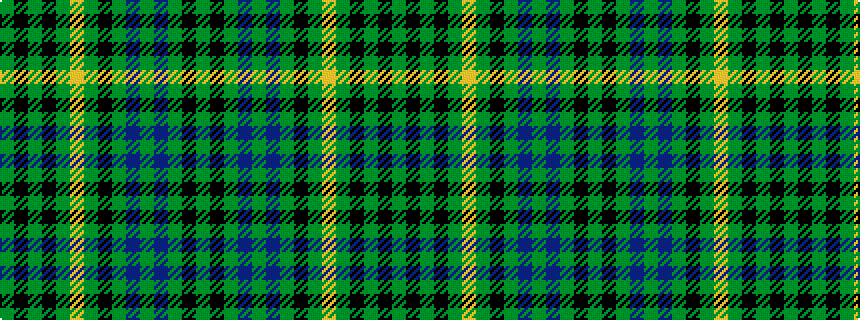

GKGBGBGKGYGKGKG

It is a 15 stripe tartan.

<figure class="pat-woven">

<figcaption>idealised sample</figcaption>
</figure>

## Colour Sequence



## Tartans with this colour sequence

| Tartans |
|---------------|
| [Glen Grant Distillery](/variants/s15/g1k1g1db10g1db1g1k4g1ly1g10k1g1k1g1~x4/)|
||
