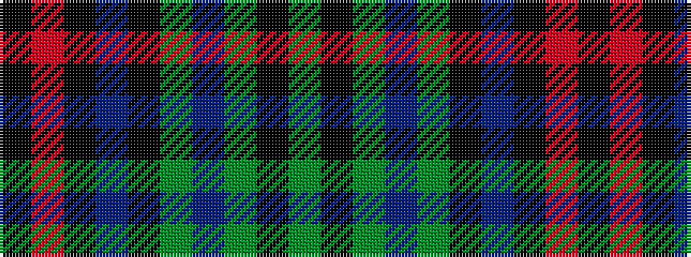

GKGBGKBKRK

It is a 10 stripe tartan.

<figure class="pat-woven">

<figcaption>idealised sample</figcaption>
</figure>

## Colour Sequence



## Tartans with this colour sequence

| Tartans |
|---------------|
| [Lochnagar Dress (Fashion)](/setts/s10/y5k1y33dp1y9k9dp5k1r2k4~x2/)|
||
